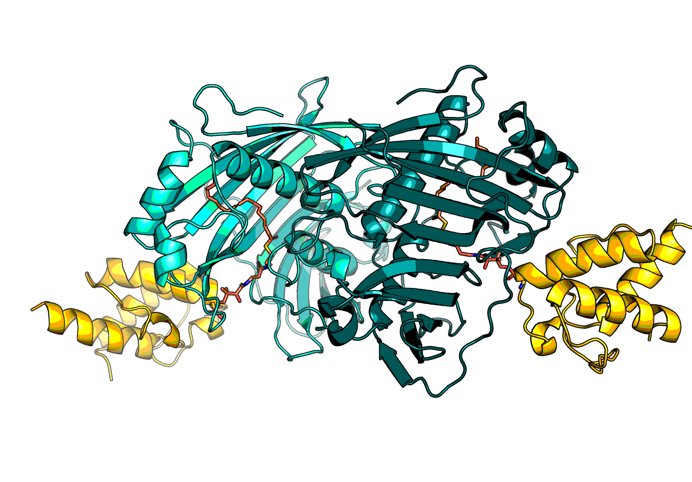

# Modelling of _Arabidopsis thaliana_ FatA in complex with its native ligand

Modelling of _A. thaliana_ FatA dimer in complex with its native ligands.
The acyl carrier protein, ACP, has a serine O-conjugated
to a phosphopantetheine, (chemical component accession: `PNS`),
which is in turn conjugated to oleic acid (`OLA`).

The most crucial state for analyses is arguably the transition state, which is the hemiacetal.
This was modelled at first especially as that is what `1R3` mimics.

The approach taken was to use PDB:1R3, alter it and energy minimise it.

* [substrate.pdb](fatA-substrate.pdb) is the substrate bound holoenzyme.
* [transition.pdb](fatA-transition.pdb) is the transition state.

## Methodology

> This work was done prior to the release of AlphaFold3. Were the project to be done now, 
> the first three steps would be replaced by AlphaFold3 predictions.

1. The tetramer of two copies of both _Arabidopsis thaliana_ FatA and ACP were modelled 
   using ColabFold (local, run on Diamond Light Source cluster). 
   ColabFold is a tool that extends AlphaFold2 with MSA generation using MMseqs2.
2. The model was superposed onto PDB:4KEH. This structure has a crosslinked analogue of the native substrate
   acyl-phosphopantatheinamide, sulfonyl-3-alkynyl-4-phosphopantetheine.
3. The ligand was converted manually into separate linked chemical components 
   phosphopantetheine (`PNS`) and oleic acyl (`OLA`) or crosslinked (ad hoc name `OLX`),
   to tailor the connectivity some amino acids were mutated also, with ad hoc names, 
   protonated glutamic acid (`GLH`) and crosslinking serine (`SEX`).
4. Multiple constrains to enforce the correct geometry of the transition state and substrate form were applied
   in PyRosetta (see [construction notebook](construction.ipynb)). The model was minimised with FastRelax
   in both cartesian and internal space, with an increasing constraint weight.

## Footnote on repo

This is not the original repository, which is private as it has multiple further tasks done for this project.
If you are looking for that please email, `matteo·ferlaⒶstats·ox·ac·uk`.
